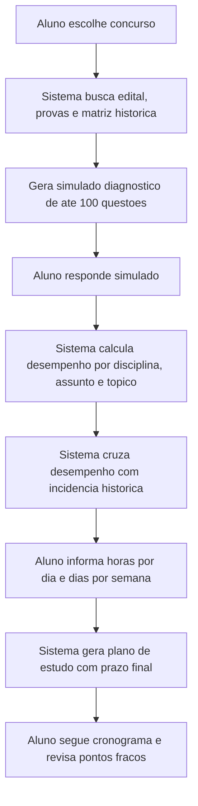

# Concurso Master / OPSConcurso - Documento Completo do Projeto

Atualizado em: 18/05/2026

## 1. Visao Geral

O Concurso Master, tambem identificado na interface como OPSConcurso, e uma plataforma SaaS para preparacao de concursos publicos. O produto centraliza questoes, simulados, estatisticas, rankings, revisoes, assinaturas, area administrativa e um modulo de planejamento de estudo baseado em diagnostico.

A proposta principal do modulo de planejamento e ir alem de um cronograma generico. O aluno escolhe o concurso-alvo, responde um simulado diagnostico montado com questoes do banco e peso baseado em edital/provas anteriores, e o sistema gera um plano de estudo com base no desempenho real por disciplina, assunto e topico.

## 2. Objetivo do Produto

O projeto busca entregar uma plataforma completa para:

- Aluno estudar questoes por filtros.
- Aluno criar ou resolver cadernos.
- Aluno fazer simulados.
- Aluno receber diagnostico de desempenho.
- Aluno gerar planejamento de estudo personalizado.
- Administrador gerenciar taxonomia, bancas, concursos, questoes e acessos.
- Professor/revisor criar, revisar e comentar questoes.
- Plataforma vender assinaturas e controlar acesso premium.
- Plataforma operar com base tecnica para LGPD.

## 3. Stack Tecnica Atual

O projeto esta organizado como monorepo com Turborepo e npm workspaces.

Stack encontrada no codigo:

- Next.js `16.1.6`
- React `19.2.4`
- TypeScript `5.9.3`
- Tailwind CSS v4
- shadcn/ui em `packages/ui`
- Prisma `6.19.3`
- PostgreSQL
- Zod
- Better Auth / Next Auth beta
- TanStack Table
- Tiptap
- Recharts
- Cloudflare R2 via AWS SDK S3
- Mercado Pago previsto no dominio financeiro
- Turborepo
- npm workspaces

Observacao: a arquitetura desejada mira compatibilidade com Prisma 7, mas a versao instalada hoje e Prisma 6.19.3.

## 4. Estrutura do Monorepo

```text
C:\projetos\ops
├── apps
│   └── web
├── packages
│   ├── auth
│   ├── database
│   ├── eslint-config
│   ├── permissions
│   ├── typescript-config
│   └── ui
├── docs
├── scripts
├── JSON
├── package.json
├── turbo.json
└── tsconfig.json
```

## 5. Workspaces

### `apps/web`

Aplicacao principal em Next.js App Router.

Responsabilidades:

- Rotas publicas.
- Area do aluno.
- Area administrativa.
- Paginas de login e cadastro.
- Modulo de questoes.
- Modulo de planejamento.
- Politica de privacidade, termos e privacidade do usuario.
- Server Actions de dominio.
- Integracao com pacotes internos.

### `packages/database`

Pacote central de banco.

Responsabilidades:

- Prisma schema.
- Cliente Prisma.
- Seeds.
- Servicos compartilhados de banco.
- Auditoria.
- Privacidade/LGPD.
- Taxonomia.
- Geracao de codigo de questao.

### `packages/ui`

Design system compartilhado.

Responsabilidades:

- Componentes shadcn/ui.
- Componentes base reutilizaveis.
- Utilitarios de UI.

### `packages/auth`

Camada de autenticacao.

Responsabilidades:

- Exportacoes de autenticacao.
- Integracao com a aplicacao web.

### `packages/permissions`

Controle de permissoes e rotas.

Responsabilidades:

- Definir rotas publicas.
- Definir rotas por papel de usuario.
- Proteger areas administrativas e areas do aluno.

## 6. Scripts Principais

Na raiz:

```bash
npm run dev
npm run build
npm run lint
npm run typecheck
npm run format
npm run download:provas:policia
npm run seed:pm-ce-soldado-dev
```

No pacote de banco:

```bash
npm --workspace @workspace/database run seed:pm-ce-soldado-dev
npm --workspace @workspace/database run seed:taxonomy
npm --workspace @workspace/database run seed:bancas
```

No app web:

```bash
npm --workspace web run dev
npm --workspace web run build
npm --workspace web run typecheck
npm --workspace web run lint
```

## 7. Principais Rotas do App

### Publicas

- `/login`
- `/signup`
- `/termos-de-uso`
- `/politica-de-privacidade`

### Area do aluno

- `/dashboard`
- `/questions`
- `/planejamento`
- `/planejamento/simulado/[id]`
- `/planejamento/diagnostico/[id]`
- `/planejamento/plano/[id]`
- `/privacidade`

### Area administrativa

- `/admin/acesso`
- `/admin/bancas`
- `/admin/carreiras`
- `/admin/concursos`
- `/admin/dificuldades`
- `/admin/disciplinas`
- `/admin/niveis-educacionais`
- `/admin/questoes`
- `/admin/questoes/criar`
- `/admin/tipos-questao`

## 8. Papeis de Usuario

O schema possui o enum `Role` com os papeis da plataforma.

Papeis previstos:

- `ALUNO`
- `PROFESSOR`
- `REVISOR`
- `SUPORTE`
- `ADMIN`
- `SUPER_ADMIN`

Uso esperado:

- Aluno: estudar, responder questoes, simulados, estatisticas, planejamento.
- Professor: criar e comentar questoes.
- Revisor: revisar questoes e materiais.
- Suporte: atendimento operacional.
- Admin: gestao de conteudo, usuarios e configuracoes.
- Super admin: acesso completo.

## 9. Dominios do Banco

O Prisma schema cobre os seguintes dominios:

### Usuarios e perfil

- `Usuario`
- `Perfil`
- `Seguidor`
- `Endereco`
- `Sessao`
- `Account`
- `Verification`
- `RecuperacaoSenha`

### Taxonomia

- `Disciplina`
- `Assunto`
- `Topico`
- `Subtopico`
- `TipoQuestao`
- `Banca`
- `Carreira`
- `NivelEducacional`
- `Dificuldade`
- `Concurso`
- `Cargo`

### Questoes

- `Questao`
- `Alternativa`
- `Tag`
- `QuestaoTag`
- `Comentario`
- `RespostaUsuario`
- `Revisao`
- `Favorito`
- `Denuncia`

### Estudo

- `Caderno`
- `ItemCaderno`
- `Simulado`
- `ItemSimulado`
- `TentativaSimulado`
- `EstatisticaUsuario`
- `Ranking`

### Inteligencia de planejamento

- `EditalConcurso`
- `EditalDisciplina`
- `EditalAssunto`
- `EditalTopico`
- `ProvaConcursoQuestao`
- `MatrizIncidenciaTopico`
- `DiagnosticoPlanejamento`
- `DiagnosticoPlanejamentoTopico`

### Financeiro

- `Plano`
- `PlanoBeneficio`
- `Assinatura`
- `Pedido`
- `PedidoItem`
- `Pagamento`

### Suporte e notificacoes

- `Ticket`
- `TicketMensagem`
- `Notificacao`
- `Configuracao`

### LGPD, auditoria e privacidade

- `ConsentimentoPrivacidade`
- `SolicitacaoPrivacidade`
- `AuditLog`

## 10. Fluxo de Planejamento de Estudo

O planejamento deve funcionar como um funil diagnostico.

### 10.1 Escolha do concurso

O aluno acessa:

```text
/planejamento
```

A primeira etapa nao deve estar presa a uma carreira fixa. O aluno escolhe um concurso real importado no banco.

A tela deve usar:

- concursos ativos;
- carreira vinculada;
- ano;
- quantidade de editais;
- quantidade de questoes;
- ocorrencias de prova importadas.

### 10.2 Analise do concurso selecionado

Apos selecionar o concurso, o sistema mostra:

- concurso escolhido;
- carreira relacionada;
- peso do edital;
- questoes disponiveis no banco;
- topicos mapeados;
- cobertura edital versus prova;
- matriz de incidencia.

### 10.3 Geracao do simulado diagnostico

O sistema gera um simulado de ate 100 questoes.

Regra atual:

- Usa questoes associadas a `ProvaConcursoQuestao`.
- Prioriza questoes vinculadas ao edital/disciplina.
- Distribui por peso de disciplinas do edital.
- Usa fallback por prova importada do concurso.
- Usa fallback por questoes publicadas do concurso.
- Salva `Simulado` e `ItemSimulado`.

Entidade principal:

- `Simulado`
- `ItemSimulado`

### 10.4 Resposta do aluno

O aluno responde as questoes em:

```text
/planejamento/simulado/[id]
```

Ao enviar:

- cria `TentativaSimulado`;
- cria `RespostaUsuario`;
- calcula acertos;
- agrupa desempenho por disciplina, assunto e topico;
- cruza desempenho com matriz historica.

### 10.5 Diagnostico

O diagnostico e criado em:

- `DiagnosticoPlanejamento`
- `DiagnosticoPlanejamentoTopico`

Classificacao por nivel:

- `OTIMO`
- `BOM`
- `MEDIO`
- `FRACO`
- `CRITICO`

Classificacao por prioridade:

- `BAIXA`
- `MEDIA`
- `ALTA`
- `MAXIMA`

Regra esperada:

- Desempenho baixo + incidencia alta = prioridade maxima.
- Desempenho medio + incidencia alta = prioridade alta.
- Desempenho baixo + incidencia baixa = prioridade media.
- Desempenho bom + baixa incidencia = prioridade baixa.

### 10.6 Disponibilidade do aluno

Antes de gerar o plano, o sistema pergunta:

- quantas horas por dia o aluno tem;
- quantos dias por semana ele estuda;
- data de inicio.

Essas entradas sao obrigatorias para gerar prazo realista.

### 10.7 Plano de estudo

O plano final gera:

- titulo do plano;
- nivel geral;
- taxa de acerto;
- total de aulas;
- total de questoes recomendadas;
- horas estimadas;
- total de dias de estudo;
- total de semanas;
- data inicial;
- data final prevista;
- cronograma por dia;
- tarefas por topico.

Pagina:

```text
/planejamento/plano/[id]
```

O plano fica salvo em `DiagnosticoPlanejamento.recomendacoes` como JSON.

## 11. Modelo Conceitual do Planejamento



## 12. Taxonomia

A taxonomia organizada esta em:

```text
C:\projetos\ops\TAXONOMIA.ORGANIZADA.json
C:\projetos\ops\TAXONOMIA.ORGANIZADA.summary.json
```

O script de organizacao esta em:

```text
C:\projetos\ops\scripts\organize-taxonomia.mjs
```

Estado documentado:

- 39 disciplinas.
- 127 assuntos.
- 266 topicos.
- 1263 subtopicos.

Disciplinas e areas reforcadas:

- Lingua Portuguesa.
- Informatica.
- Direito Administrativo.
- Seguranca Publica.
- Direito Constitucional.
- Direito Penal.
- Direito Processual Penal.
- Direitos Humanos.
- Legislacao especifica.
- Arquivologia.
- Estatistica.
- Contabilidade Publica.
- AFO.
- Direito Civil.
- Direito Processual Civil.
- Direito Eleitoral.
- Direito Ambiental.
- Direito Tributario.
- Direito Previdenciario.

## 13. PM CE Soldado - Base de Desenvolvimento

Foi criada uma base isolada de desenvolvimento para PM CE Soldado.

Local:

```text
C:\projetos\ops\scratch\pm-ce-soldado-dev
```

Provas mapeadas pelo usuario:

- 2006
- 2008
- 2012
- 2014
- 2021
- 2025

Importacao ja estruturada anteriormente:

- questoes PM CE 2021/2025;
- alternativas;
- gabarito;
- edital;
- matriz de incidencia;
- cobertura edital versus prova.

Seed:

```bash
npm run seed:pm-ce-soldado-dev
```

## 14. LGPD e Privacidade

A plataforma possui base tecnica para conformidade com a LGPD.

Implementacoes ja existentes:

- paginas de termos e politica;
- area de privacidade do usuario;
- banner de consentimento de cookies;
- consentimento separado para cookies analiticos e marketing;
- registro de consentimentos no banco para usuario logado;
- solicitacoes de privacidade;
- auditoria de acoes relevantes;
- endurecimento de upload;
- headers de seguranca.

Rotas:

```text
/termos-de-uso
/politica-de-privacidade
/privacidade
```

Modelos:

- `ConsentimentoPrivacidade`
- `SolicitacaoPrivacidade`
- `AuditLog`

Eventos/servicos:

- `packages/database/src/services/privacy.ts`
- `packages/database/src/services/audit.ts`
- `apps/web/actions/privacy-actions.ts`

Observacao importante:

Conformidade LGPD completa nao e apenas codigo. Para producao ainda precisa:

- revisao juridica dos textos;
- definicao formal do encarregado/DPO;
- politica operacional de retencao;
- rotina real de exclusao/anonimizacao;
- exportacao baixavel dos dados do titular;
- contratos com operadores;
- revisao de analytics, marketing, pagamentos, hospedagem e storage;
- inventario de dados pessoais e bases legais.

## 15. Auditoria

O projeto possui `AuditLog` para registrar eventos relevantes.

Eventos ja usados ou previstos:

- criacao de simulado diagnostico;
- envio de diagnostico;
- geracao de plano;
- acoes administrativas;
- acoes relacionadas a privacidade.

Campos importantes:

- usuario;
- acao;
- tabela;
- registro;
- dados antes;
- dados depois;
- IP;
- user agent.

## 16. Escala para 10 Mil Usuarios

O schema recebeu indices adicionais para melhorar consultas em tabelas pesadas.

Areas reforcadas:

- respostas do usuario;
- questoes;
- simulados;
- tentativas;
- diagnosticos;
- estatisticas;
- rankings;
- revisoes;
- favoritos;
- denuncias;
- financeiro;
- suporte;
- auditoria;
- sessoes;
- privacidade.

Exemplos de consultas otimizadas:

- respostas por usuario e periodo;
- questoes erradas;
- desempenho recente;
- respostas por simulado;
- respostas por caderno;
- questoes por disciplina, assunto e topico;
- questoes por banca, concurso e status;
- diagnosticos por usuario;
- tickets por status;
- pagamentos por status.

Pendencias para escala maior:

- jobs de agregacao de estatisticas;
- cache para dashboards;
- paginacao consistente em todas as tabelas administrativas;
- limpeza/retencao de `AuditLog`;
- possivel particionamento futuro de `RespostaUsuario`;
- busca textual estruturada para questoes;
- observabilidade de producao;
- fila para processamento pesado.

## 17. Modulo de Questoes

Funcionalidades previstas ou existentes:

- filtro por carreira, concurso, banca, disciplina, assunto, topico, subtopico;
- card de questao;
- alternativas;
- explicacao/comentario;
- painel de revisao;
- denuncia;
- favorito;
- estatisticas agregadas;
- acesso free/premium;
- criacao administrativa de questoes.

Arquivos importantes:

```text
apps/web/app/questions/page.tsx
apps/web/components/questions/filter/question-filter.tsx
apps/web/components/questions/card/question-card.tsx
apps/web/components/admin/questions/create/create-question-form.tsx
apps/web/features/questions/services/question.service.ts
apps/web/features/questions/services/admin-question.service.ts
```

## 18. Area Administrativa

A area administrativa permite gerenciar:

- acessos;
- bancas;
- carreiras;
- concursos;
- dificuldades;
- disciplinas;
- niveis educacionais;
- questoes;
- tipos de questao;
- taxonomia.

Padrao esperado:

- tabelas com paginacao;
- filtros;
- busca;
- estados vazios;
- formularios com validacao;
- separacao entre dominio admin e dominio aluno;
- componentes reutilizaveis.

## 19. Financeiro

O dominio financeiro esta modelado no banco.

Entidades:

- `Plano`
- `PlanoBeneficio`
- `Assinatura`
- `Pedido`
- `PedidoItem`
- `Pagamento`

Enums:

- `StatusAssinatura`
- `StatusPedido`
- `MetodoPagamento`
- `StatusPagamento`

Uso esperado:

- planos free/premium;
- assinatura ativa;
- controle de acesso;
- pagamento via Mercado Pago;
- pedidos e itens;
- historico financeiro.

Pendencia:

- confirmar implementacao completa de checkout, webhooks e conciliacao.

## 20. Upload e Storage

O projeto usa Cloudflare R2 com API compativel S3.

Arquivo principal:

```text
apps/web/lib/storage.ts
```

Regras tecnicas ja endurecidas:

- limite de 5 MB;
- MIME types permitidos;
- suporte a imagens e PDF;
- rejeicao de arquivos fora da lista permitida.

## 21. Padroes de UI

Padrao visual desejado:

- SaaS moderno;
- minimalista;
- dark mode;
- pouca sombra;
- bordas discretas;
- `rounded-xl` ou `rounded-2xl`;
- layout limpo;
- boa densidade de informacao;
- foco em produtividade;
- responsivo;
- componentes desacoplados.

Diretriz por area:

- Area do aluno: clareza, foco e progresso.
- Area admin: produtividade operacional.
- Planejamento: visual de diagnostico e cronograma.
- Questoes: leitura confortavel e resposta rapida.

## 22. Padroes de Codigo

Padroes definidos para o projeto:

- TypeScript estrito.
- Server Components quando possivel.
- Client Components somente quando necessario.
- Server Actions para mutacoes simples.
- Route Handlers para APIs.
- Prisma centralizado em `packages/database`.
- Componentes por dominio.
- Validacao com Zod.
- Formularios preferencialmente com react-hook-form + Zod.
- Evitar overengineering.
- Evitar bibliotecas desnecessarias.
- Evitar componentes gigantes.
- Separar UI de regra de negocio.

## 23. Segurança

Medidas ja presentes ou previstas:

- controle de rotas por permissao;
- headers de seguranca;
- auditoria;
- consentimento;
- protecao de upload;
- autenticacao;
- papeis de usuario;
- senha obrigatoria na criacao de usuario;
- separacao de rotas publicas e autenticadas.

Pontos para revisar antes de producao:

- rate limit em login e cadastro;
- protecao CSRF conforme estrategia de auth;
- validacao de webhooks;
- secrets fora do repositorio;
- logs sem dados sensiveis;
- monitoramento de erros;
- backup do banco;
- rotinas de restore testadas.

## 24. Migrations Importantes

Migrations existentes no pacote de banco:

```text
20260517005556_add_premium_question_fields
20260517120000_add_question_code_sequence
20260518012132_add_planning_intelligence_models
20260518115424_add_privacy_lgpd_models
20260518120443_add_question_response_query_indexes
20260518120755_add_10k_scale_indexes
```

## 25. Estado Atual do Planejamento

Ja existe:

- rota de entrada `/planejamento`;
- selecao de concurso-alvo;
- geracao de simulado diagnostico;
- resposta de simulado;
- diagnostico;
- formulario de disponibilidade;
- geracao de plano;
- cronograma por dia;
- salvamento do plano em JSON no diagnostico.

Pontos a melhorar:

- criar tabela propria para planos de estudo em vez de salvar apenas JSON;
- permitir acompanhar progresso do plano;
- permitir remarcar dias;
- permitir revisoes espacadas;
- permitir gerar calendario mensal;
- permitir exportar para PDF;
- permitir sincronizar com Google Calendar/Outlook no futuro;
- recalcular plano quando aluno melhora ou atrasa;
- diferenciar aulas, leitura, questoes e revisao.

## 26. Proposta de Evolucao do Planejamento

### Fase 1 - Estabilizar fluxo atual

- Selecionar concurso.
- Gerar simulado.
- Responder.
- Gerar diagnostico.
- Perguntar disponibilidade.
- Gerar plano.

### Fase 2 - Persistencia estruturada

Criar modelos:

- `PlanoEstudo`
- `PlanoEstudoDia`
- `PlanoEstudoTarefa`
- `PlanoEstudoProgresso`

Beneficios:

- acompanhar conclusao;
- remarcar tarefas;
- medir atraso;
- recalcular plano;
- gerar relatorios.

### Fase 3 - Calendario visual

Criar uma tela parecida com agenda:

- visao semanal;
- visao mensal;
- blocos por disciplina;
- cores por prioridade;
- status: pendente, feito, atrasado;
- filtros por disciplina.

### Fase 4 - Motor adaptativo

Recalcular planejamento com base em:

- novas respostas;
- desempenho recente;
- revisoes vencidas;
- tempo disponivel atualizado;
- data da prova;
- atraso acumulado.

## 27. Riscos Tecnicos

Principais riscos:

- `RespostaUsuario` crescer muito rapido.
- `AuditLog` crescer sem retencao.
- planejamento salvo apenas em JSON dificultar consultas.
- falta de jobs de agregacao.
- falta de cache em dashboards.
- dados historicos incompletos por concurso.
- matriz de incidencia dependente da qualidade da classificacao.
- LGPD depender de processos fora do codigo.

## 28. Recomendacoes de Proximos Passos

Prioridade alta:

1. Criar modelos estruturados para `PlanoEstudo`.
2. Criar tela calendario do plano.
3. Implementar progresso por tarefa.
4. Criar rotina de recalculo do plano.
5. Importar/normalizar mais editais e provas.
6. Melhorar cobertura de matriz por carreira.
7. Implementar rotina de exportacao de dados LGPD.

Prioridade media:

1. Criar dashboard de progresso do planejamento.
2. Criar notificacoes de tarefas atrasadas.
3. Criar revisao espacada.
4. Criar exportacao PDF.
5. Criar cache de estatisticas.

Prioridade baixa:

1. Integrar calendario externo.
2. Criar recomendacao por IA.
3. Criar trilhas por nivel de aluno.

## 29. Comandos de Validacao

Validacao do app web:

```bash
npm.cmd --workspace web run typecheck
```

Validacao geral:

```bash
npm.cmd run typecheck
```

Servidor local:

```bash
npm.cmd --workspace web run dev
```

Prisma:

```bash
npx prisma validate --schema packages/database/prisma/schema.prisma
```

## 30. Conclusao

O Concurso Master ja possui uma base forte de produto SaaS para concursos:

- monorepo organizado;
- banco amplo;
- area de questoes;
- area administrativa;
- planejamento diagnostico;
- privacidade/LGPD tecnica;
- indices para escala inicial;
- taxonomia ampla;
- fluxo inicial de estudo personalizado.

O ponto mais importante agora e transformar o planejamento em um modulo persistente e acompanhavel. O fluxo ideal nao termina em gerar um plano: ele deve acompanhar a execucao diaria, medir atraso, recalcular prioridades e mostrar quando o aluno realmente fecha o edital.
